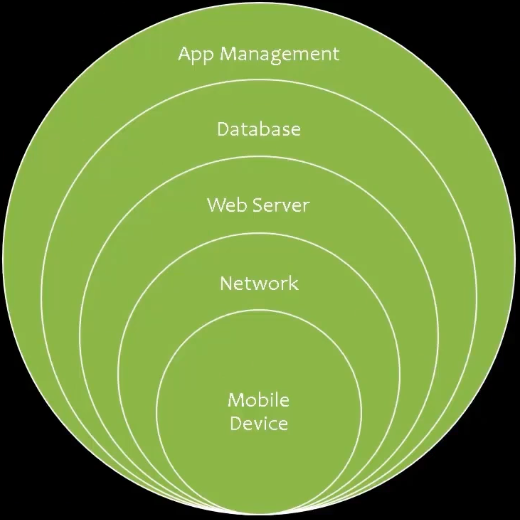

# 01_Mobile Attack Surface

[Mobile Attack Surface 👉VIDEO &#128279;](https://codered.eccouncil.org/courseVideo/Kali-for-Penetration-Testers?lessonId=9b787e3b-237e-4a7f-9dfe-c35a5407ebad&finalAssessment=false)

### Mobile Attack Surface

- **Mobile Device Threats**
  - Data storage
  - Data transmission
  - Reverse engineering
  - Application access management
- **Network Threats**
  - Wireless connectivity
  - Session hijacking
  - DNS spoofing
- **Web Server Threats**
  - Patch management
  - Access management
  - Brute force attacks
- **Database Threats**
  - Privileged access
  - SQL injections
  - Database updates
  - Validation of data
- **Application Management Threats**
  - App deployment
  - Remote wiping
