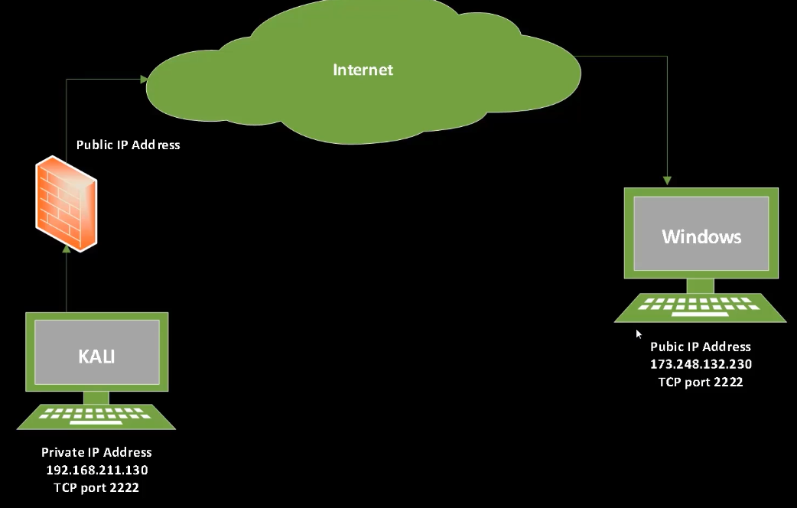

# 03_Netcat Simplified

[Netcat Simplified 👉VIDEO &#128279;](https://codered.eccouncil.org/courseVideo/Kali-for-Penetration-Testers?lessonId=45330504-b8bc-4366-8462-fdf6753bba21&finalAssessment=false)

## Netcat Simplified

### Used to

- Scan and connect to an arbitrary port
- Create a listener on a local port
- Transfer files
- Remote administration (bind shell and reverse shell)

### nc [flag options][target IP address][port]

**Options we will use are:**

- `l = listen mode, e=program to execute after connection is established`
- `n= don't perform DNS lookups, v=verbose, p=local port`

### Download Netcat for Windows

- [Download_1 &#128279;](https://github.com/diegocr/netcat)
- [Download_2 &#128279;](https://eternallybored.org/misc/netcat)

**Command**

- nc -nv <ipaddress> <port>
  - nc -nv 192.168.1.10 8010
