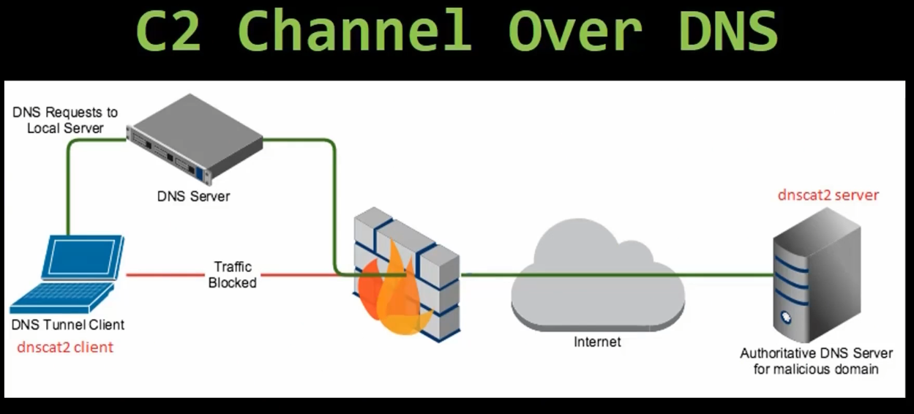

# 08_Bypass Firewalls by Tunneling Data and Commands Over DNS

[Bypass Firewalls by Tunneling Data and Commands Over DNS 👉VIDEO &#128279;](https://codered.eccouncil.org/courseVideo/Kali-for-Penetration-Testers?lessonId=9d8fef63-b97f-4dba-9e79-a9e6eca711d8&finalAssessment=false)

### Install and Run dnscat2 Server

- apt-get update
- apt-get -y install ruby-dev git make g++
- gem install bundler
- git clone https://github.com/iagox86/dnscat2.git
- cd dnscat2/server
- bundle install
- ruby /dnscat2.rb
