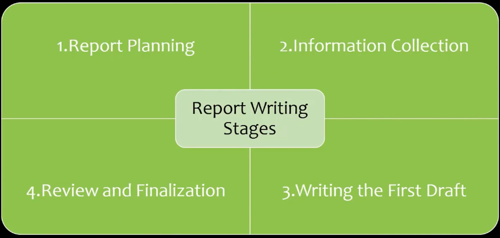
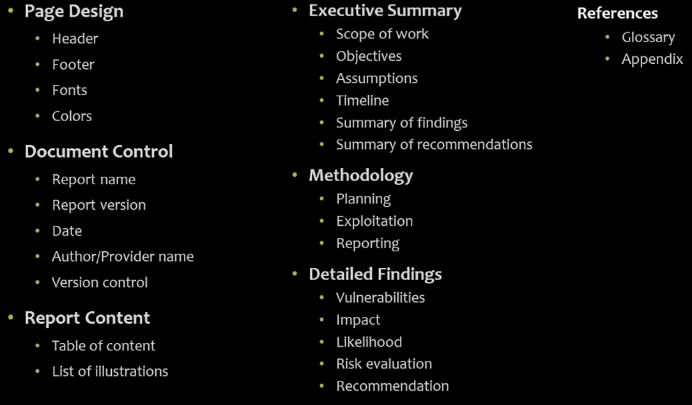

# 01_Report Writing Techniques

[Report Writing Techniques 👉VIDEO &#128279;](https://codered.eccouncil.org/courseVideo/Kali-for-Penetration-Testers?lessonId=8d46c440-79a0-4a30-9e65-b6223e5fc63f&finalAssessment=false)

## Writing a Penetration Testing Report

### Report Plaining

- Objectives (for example: ISMS or PCI compliance)
- Assumptions
- Timeline
- Target audience (support different levels of details)
- Report calssification (Highest)
- Report distrubution (Copy#, Dept., Recipient, Date)

### Information Collection

- Tools and system used
- Scanning results
- Vulnerability assessments
- Screenshots
- Use documentation tools
- Take notes
- Log activities

### Writing the First Draft

- Analyze and write the findings
- Mention all activities
- Mention all processes
- Mention the personal experience

### Review and Finalization

- Team members
- Peer review for second opinion
- QA

### Sample Report Layout

