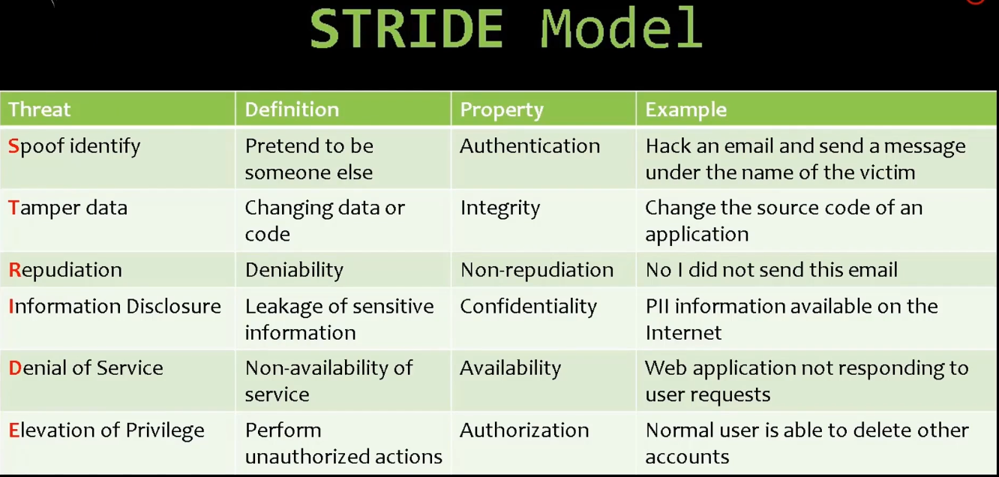

# 01_Step to Plana sucessful Penetratin Testing

[Step to Plana sucessful Penetratin Testing 👉VIDEO &#128279;](https://codered.eccouncil.org/courseVideo/Kali-for-Penetration-Testers?lessonId=61daf3c8-98e5-43c9-904f-2f54800da920&finalAssessment=false)

1. **Optimize network and application security**

   - Identify assets
   - Architercture Overview
   - Decompose System/ Application
   - Identify Threats
   - Document Threats
   - Rate Threats

2. Threat Modeling

   - Threat
     - Realized through
       - Attack
         - Materialized through
           - Vulnerability
             - Mitigated with
               - Countermeasure

3. Why Threat Modeling

   - Identifying, investigating and rating potential threats and vulnerabilities
   - Identifying logical thought processes for defining the system's security
   - Creating a set of standard documents that can be used to create specificatins and security testing and prevent future duplication of security efforts
   - Reducing threats and vulnerabilities
   - Defing the overall security level of a system or application

4. Threat Modling Techniques
   - Technique
   - Attack Trees
   - Stride
   - Elevation of Privilege
   - T-MAP
   - Petri Net
   - Data Flow Diagram
   - Activity Diagram
   - Risk Reduction Overview

## Stride Model

| Threat Type                    | Description                            | Example                               | Mitigation                              |
| ------------------------------ | -------------------------------------- | ------------------------------------- | --------------------------------------- |
| **S - Spoofing**               | Impersonating another entity           | Logging in as another user            | Multi-factor authentication             |
| **T - Tampering**              | Modifying data or system resources     | Modifying database entries            | Data encryption, integrity checks       |
| **R - Repudiation**            | Denying actions without proof          | Denying a financial transaction       | Logging and auditing mechanisms         |
| **I - Information Disclosure** | Exposing sensitive data                | Data leakage via unencrypted channels | Encrypt sensitive data                  |
| **D - Denial of Service**      | Disrupting system availability         | DDoS attack on a web server           | Rate limiting, redundancy               |
| **E - Elevation of Privilege** | Gaining unauthorized higher privileges | Gaining root access via vulnerability | Least privilege, vulnerability patching |

