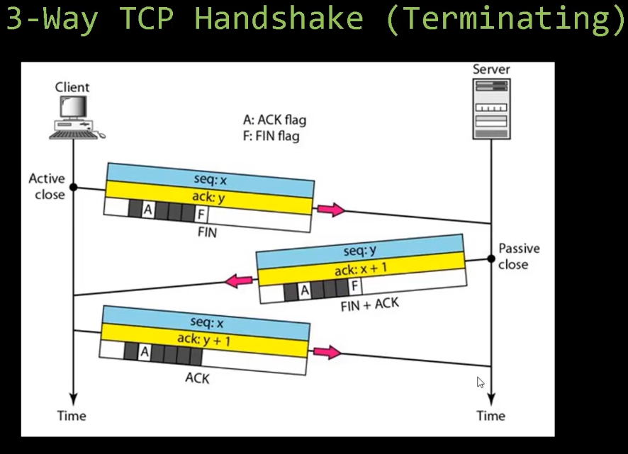
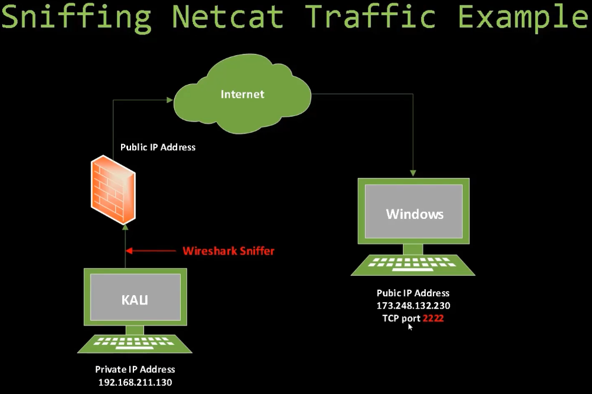

# 01_Wireshark Simplified

[Wireshark Simplified 👉VIDEO &#128279;](https://codered.eccouncil.org/courseVideo/Kali-for-Penetration-Testers?lessonId=793b1fc1-8d6e-4e63-9821-ea757da575ce&finalAssessment=false)

## Wireshark Simplified

A sniffing tool used to:

- Understand a protocol
- Debug a network issue
- Analyze traffic
- Uses Libpcap on Linux and Winpcap on Windows
- The secret is to use the Capture and Display filters

