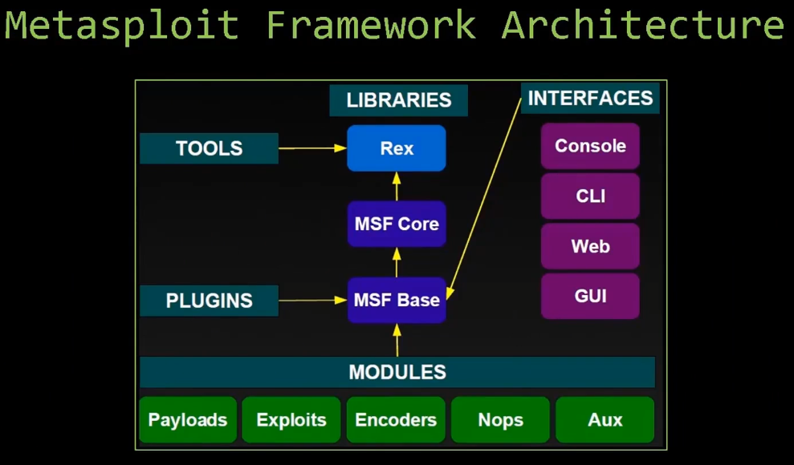

# 09_All-in-one Metasploit Framework

[All-in-one Metasploit Framework 👉VIDEO &#128279;](https://codered.eccouncil.org/courseVideo/Kali-for-Penetration-Testers?lessonId=68db8b80-c040-47e0-9e98-314fb892e684&finalAssessment=false)

**Command**

- `search type:exploit`
- `search type:exploit platform:windows`
- `search type:exploit platform:ubuntu`
- `search cve:2017`
- `search name:wordpress`

**Usage**

- msf > `use exploit/unix/webapp/wp_total_cache_exec`
  - msf > `exploit (unix/webapp/wp_total_cache_exec) > show targets`
  - show info

Exciting News
I've just leveled up to Silver League on Google Cloud Skills Boost with a total of 6695 points.

I've been diving into labs and quests, learning more about cloud technology every day. Just a few hundred more points until I reach Gold League—let's gooo!

Big shoutout to everyone who’s been on this journey with me
let's keep pushing boundaries and leveling up together
