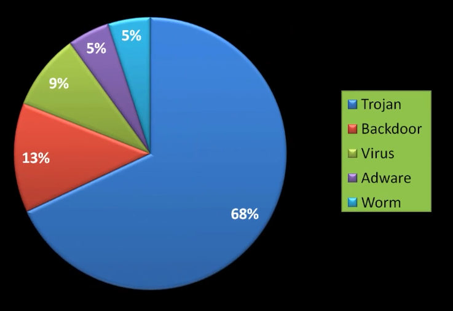

# 01_WebApplications Security OverView

[WebApplications Security OverView 👉VIDEO &#128279;](https://codered.eccouncil.org/courseVideo/Kali-for-Penetration-Testers?lessonId=2494af32-f009-4f3b-bc4a-33e678282b40&finalAssessment=false)

### Where are the Security Flaws?

- Not identifying security requirements `up front`
- Creating conceptual designs that have `logic errors`
- Using `poor coding practices` that introduce technical vulnerabilities
- Deploying the software `improperly`
- Introducing `flaws` during maintenance or updating

### How Bad Is It?

- Watchfire reported **97% of 300** Web Applications audited were vulnerable
- Trustwave Reported **7 out 10** Web Applications audited were vulnerable
- Others typically report **90-90%** of Web Applications vulnerable
- Gartner **(Gartner is best known for its `Magic Quadrant reports`, which provide in-depth analysis of different technology companies and products.)** reports **75%** of attacks today are at the application level

### Malware Categories on Websites Designed by Cyber Criminals

### Most Populare Content Management Systems

- WordPress 28.6%
- Joomla 3.3%
- Drupal 2.3%
- Magento 1.1%
- Blogger 1.0%
- Shopify 0.8%
