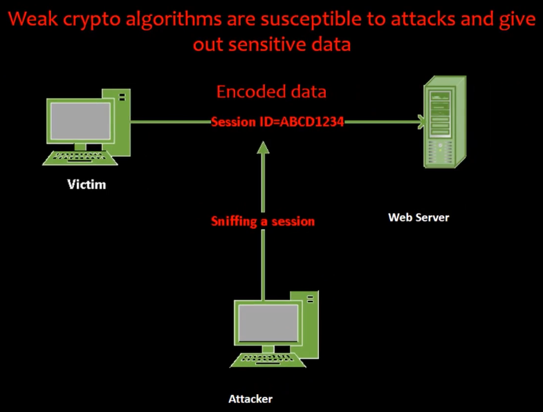
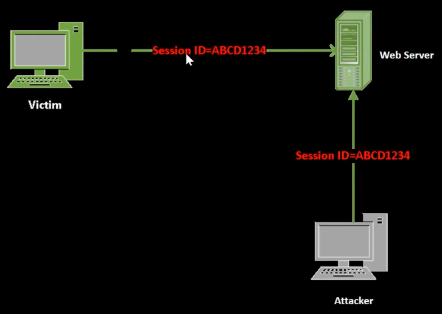

# 06_Sensitive Data Exposure Vulnerabilities

[Sensitive Data Exposure Vulnerabilities 👉VIDEO &#128279;](https://codered.eccouncil.org/courseVideo/Kali-for-Penetration-Testers?lessonId=bf421e62-c539-4935-9c0c-9bb7cadd7975&finalAssessment=false)

### A3-Sensitive Data Exposure

- Applications can unintentionally leak information about their **configuration**, **internal working**, or **violate privacy** through a variety of application problems
- Attackers use this weakness to steal sensitive data or conduct more serious attacks

- Prevent display of detailed internal error messages including **stack traces**, messages with **database** or **table names, protocols**, and other error codes. (This can provice attackers clues as to potential flaws)
- Provide short error messages to the user while logging detailed error information to an internal log file
- Encrypt all data **in transit** and **at rest**
- Use **secure** protocols and algorithms
- Disable caching of responses with sensitive data
