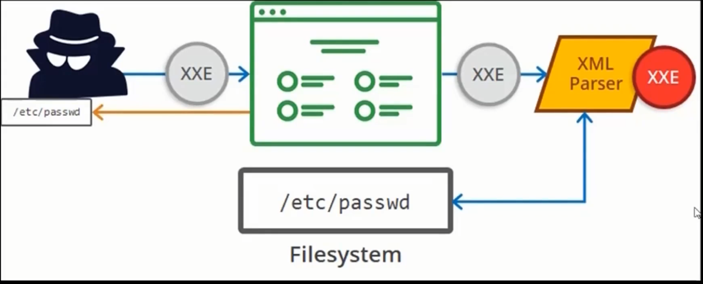

# 07_XML External Entities (XXE) Vulnerabilities

[XML External Entities (XXE) Vulnerabilities 👉VIDEO &#128279;](https://codered.eccouncil.org/courseVideo/Kali-for-Penetration-Testers?lessonId=ddca0540-d410-4951-843c-b7dd83c1cf25&finalAssessment=false)

### A4-XML External Entity

- An application is vulnerable to XXE attacks if it enables users to upload a malicious XML which further exploits the vulnerable code
- This can be used to execute code, steal data and perform other malicious tasks

  

- Avoid serialization of sensitive data
- Implement whitelisting approach at server side to prevent malicious XML upload
- Use of WAF to detect and block XXE
- Code review
