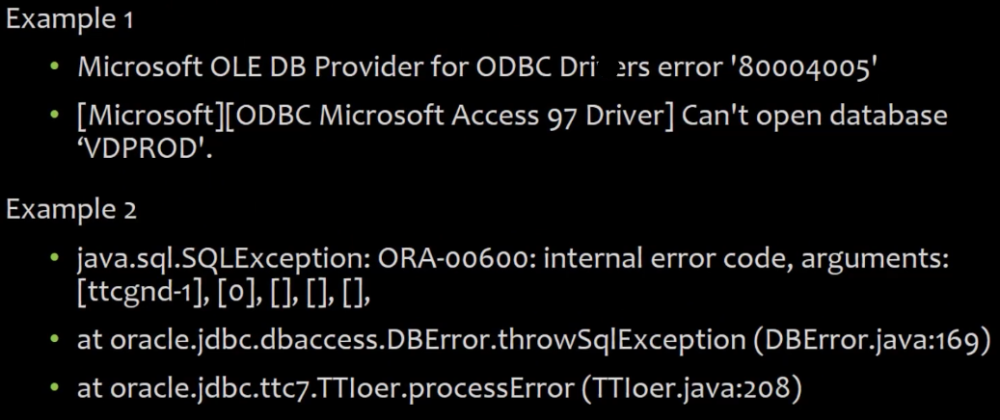

# 09_Security Misconfiguration Vunerabilities

[Security Misconfiguration Vunerabilities 👉VIDEO &#128279;](https://codered.eccouncil.org/courseVideo/Kali-for-Penetration-Testers?lessonId=aafb9ae6-ae46-4706-8143-1d6523eb1a89&finalAssessment=false)

### A6-Security Misconfiguration

- Security requirements not followed on servers
- Best practices not used
- Favoring practicality over security
- Directory listing available
- Default error messages
- Default passwords
- Weak passwords
- Default scripts

- Follow a hardening porcess for both hardware and applications
- Do ensure that defaults are changed
- Install only the required features from a framework
- Review the security of the configurations at fixed intervals
