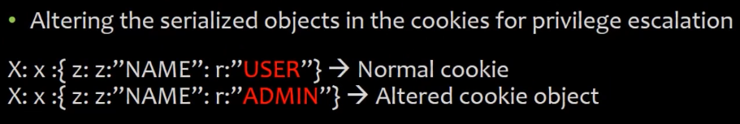

# 11_Insecure Deserialization Vulnerabilities

[Insecure Deserialization Vulnerabilities 👉VIDEO &#128279;](https://codered.eccouncil.org/courseVideo/Kali-for-Penetration-Testers?lessonId=2503dd89-dc5e-4b6a-bb1d-c38bedfae668&finalAssessment=false)

### A8-Insecure Deserialization

- Serialized saved objects
- Dependency on client saved data

