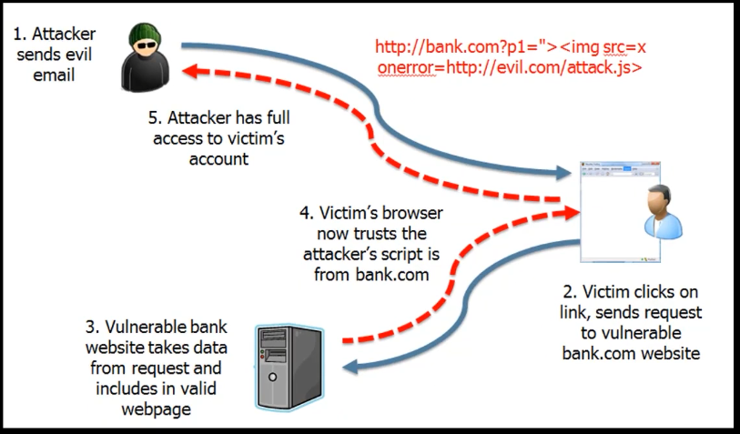
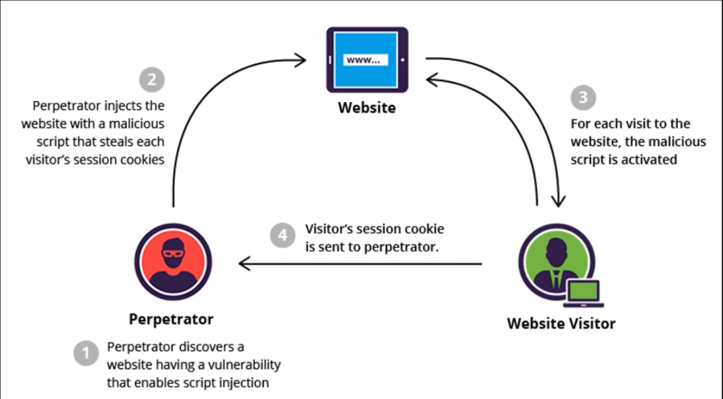
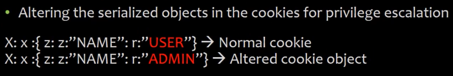

# 10_Cross-Site Scripting (XSS) Vulnerabilites

[Cross-Site Scripting (XSS) Vulnerabilites 👉VIDEO &#128279;](https://codered.eccouncil.org/courseVideo/Kali-for-Penetration-Testers?lessonId=aafb9ae6-ae46-4706-8143-1d6523eb1a89&finalAssessment=false)

### A7-Cross-Site Scripting(XSS)

- XSS enables attackers to inject **client-side scripts** into vulnearble legitimate web pages viewed by other users
- The target of the attack **trusts the Web application** and thus XSS attacks exploit that trust to do things that would not normally be allowed

**Categories of XSS attacks:**

- **Reflected** (Non Persistent) - attacks that are relected take some other route to the victiom (through an e-mail message, or bounced off from some other server)
  - The attack typically takes the form of an HTML tag (frequently a hyperlink) that contains malicious scripting (often JavaScritp)
  - This is usually done whtn there is a location that arbitrary content can be entered into(such as an e-mail message, or free text field for example) and then referenced by the target of the attack
  - **Stored** (Persistent) - the injected code is permanently stored (in a database, message forum, visitor log, etc.)

**How to protect ourself**

- Encryption of the serialized data
