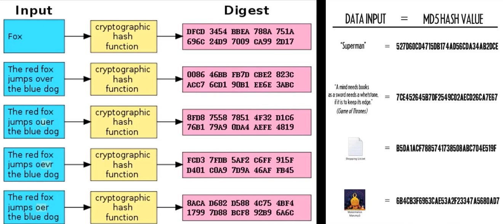
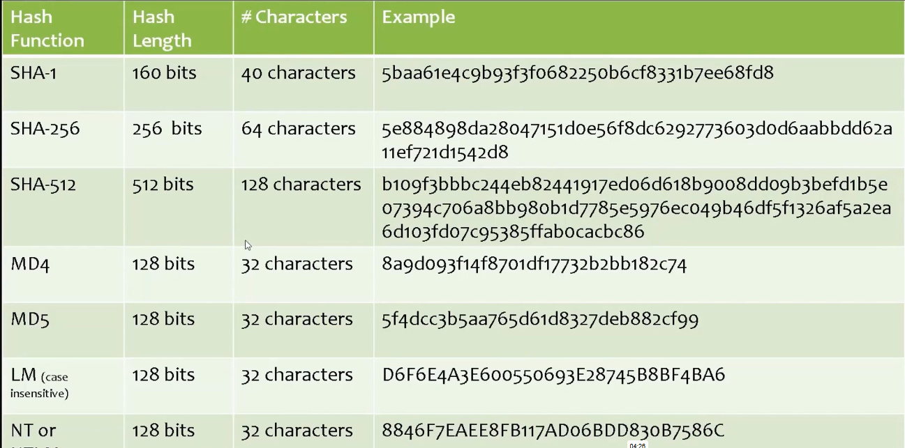

# 02_Hashing in a Nutshell

[Hashing in a Nutshell 👉VIDEO &#128279;](https://codered.eccouncil.org/courseVideo/Kali-for-Penetration-Testers?lessonId=701f9843-b956-4187-8dde-544fdcef1ff7&finalAssessment=false)

### Hashing in a Nutshell

### Usage

- File Verification
- Password Storage
- Database Searching

**Command**

### Power shell

- `Get-FileHash .\msdia80.dll`

### Mostly Used Hashes

